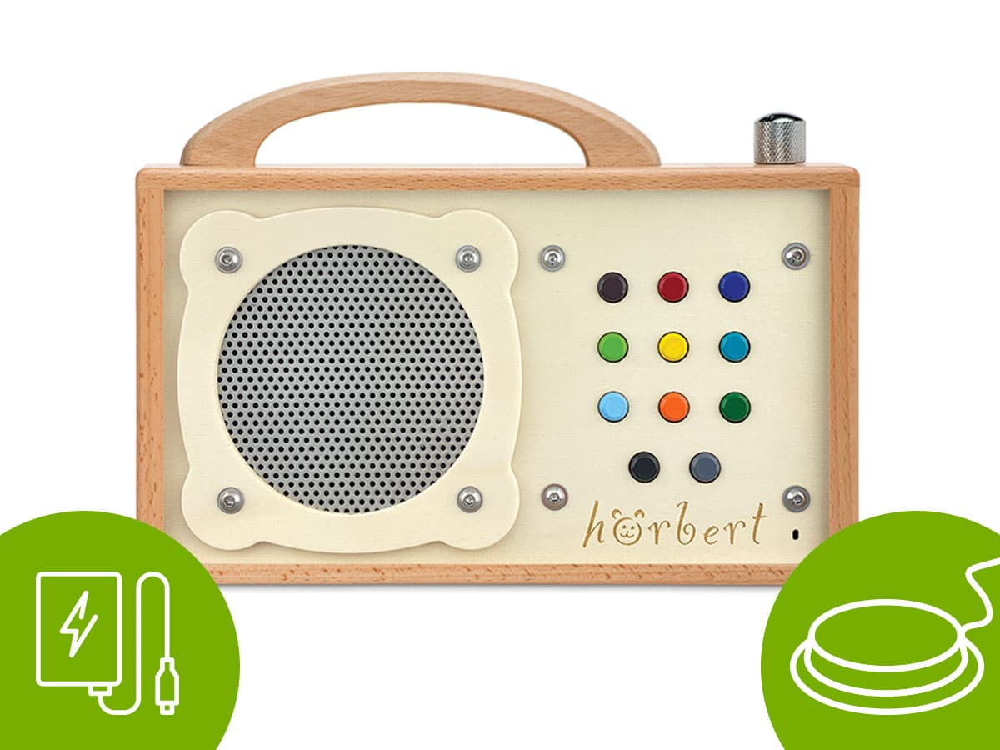

## SpotiStation
Quelle: https://github.com/NemoAndrea/SpotiStation?utm_source=chatgpt.com

Ein Open-Source-Projekt mit Fokus auf einfache Bedienung über physische Tasten und Spotify-Integration. Allerdings erfordert der Aufbau technisches Know-how und externe Bluetooth-Lautsprecher.  

**Unterschiede / Schwächen**
- Keine Weblösung, sondern auf Raspberry Pi basierendes Hardwareprojekt
- Nicht tastaturbedienbar – Steuerung nur über physische Knöpfe
- Keine Integration visueller Assistenzsysteme (z. B. Fokusführung im UI)
- Spotify-Account und API-Kenntnisse notwendig
- Erfordert technisches Know-how (Aufbau, Konfiguration, evtl. 3D-Druck)

**Positive Aspekte**
- Minimalistisches und reduziertes Interface
- Große physische Tasten als klare Interaktionsflächen
- Integration der Spotify API → moderne Anwendungsmöglichkeit
- Open-Source und individuell erweiterbar
- Visuelles Feedback über LED-Display – Inspiration für reduzierte visuelle Rückmeldungen

## Joy Player
Quelle: https://www.aph.org/product/joy-player/?utm_source=chatgpt.com (Hardware Lösung)

Ein speziell für Personen mit Seh- und Mehrfachbehinderungen entwickelter Musikplayer mit Unterstützung externer Schalter. Die Bedienung ist einfach, jedoch nicht vollständig tastaturbedienbar.  

**Unterschiede / Schwächen**
- Reines Hardwaregerät – keine Web- oder Softwarelösung
- Nicht frei konfigurierbar oder anpassbar (geschlossene Plattform)
- Keine Tastaturbedienbarkeit im klassischen Sinne (nur Hardwaretasten)
- Preislich im höheren Bereich (349 USD)

**Positive Aspekte**
- Fokus auf Menschen mit Mehrfachbehinderungen (auch sehbehindert)
- Unterstützt externe Schalter für alternative Eingabemethoden
- Sehr einfache Bedienlogik mit klaren, haptischen Tasten
- Solide Verarbeitung, für Alltag und Pflegeeinrichtungen geeignet

## Hoerbert
Quelle: https://www.hoerbert.com/hoerbert-barrierefrei/?srsltid=AfmBOoq96Mi1OGAHiOF8LheEWWLjPV86mlOds8rJtq68xdW53SYBkYhM (Hardware)

Ein robuster Musikplayer mit verschiedenen Modellen für unterschiedliche Bedürfnisse. Die Bedienung erfolgt über große Tasten, und es gibt Unterstützung für externe Schalter. Allerdings ist keine vollständige Tastaturbedienung möglich.  

**Unterschiede / Schwächen**
- Reines Hardwareprodukt, nicht webbasiert
- Keine klassische Tastaturnavigation oder visuelle Interfaceführung
- Bedienlogik über Hardware festgelegt (nicht individualisierbar)
- Musik muss vorab manuell auf SD-Karte übertragen werden

**Positive Aspekte**
- Modelle mit 1, 3 oder 11 Tasten – anpassbar an individuelle Fähigkeiten
- Unterstützung für externe Schalter
- Unterstützt Bluetooth, Internetradio und viele Audioformate
- Langlebig, robust, kinderfreundlich

## Webdesign Weisshart
Quelle: https://webdesign.weisshart.de/aap.php#comment_head (veraltet)

Ein vollständig tastaturbedienbarer Webplayer mit klarer Fokusführung und Screenreader-Kompatibilität. Allerdings ist das Projekt veraltet und wird nicht mehr aktiv gepflegt.  

**Unterschiede / Schwächen**
- Veraltetes HTML/CSS-Design, nicht responsive
- Keine aktive Weiterentwicklung oder moderne Framework-Integration
- Eingeschränkter Funktionsumfang (nur Basis-Player)

**Positive Aspekte**
- Vollständig tastaturbedienbar
- Fokusführung nachvollziehbar umgesetzt
- Screenreader-kompatibel
- Reines Webprojekt – ohne Installation nutzbar
- HTML5-Standard → einfach nachvollziehbar, minimalistisch

## Weitere ähnliche Lösungen
- [lift Player](https://smpltec.com/liftplayer-buy-now-us/)
- [BBrain Musikspieler](https://bbrain.eu/bbrain-muziekspeler/)
- [the simple music player by iGuerburn](https://www.iguerburn.com/products/dementia-music-player)

## Fazit
- Bestehende Lösungen sind überwiegend hardwarebasiert und nicht vollständig tastaturbedienbar.
- Webbasierte Ansätze wie Weissharts Player sind funktional, aber technisch veraltet und nicht mehr aktiv gepflegt.