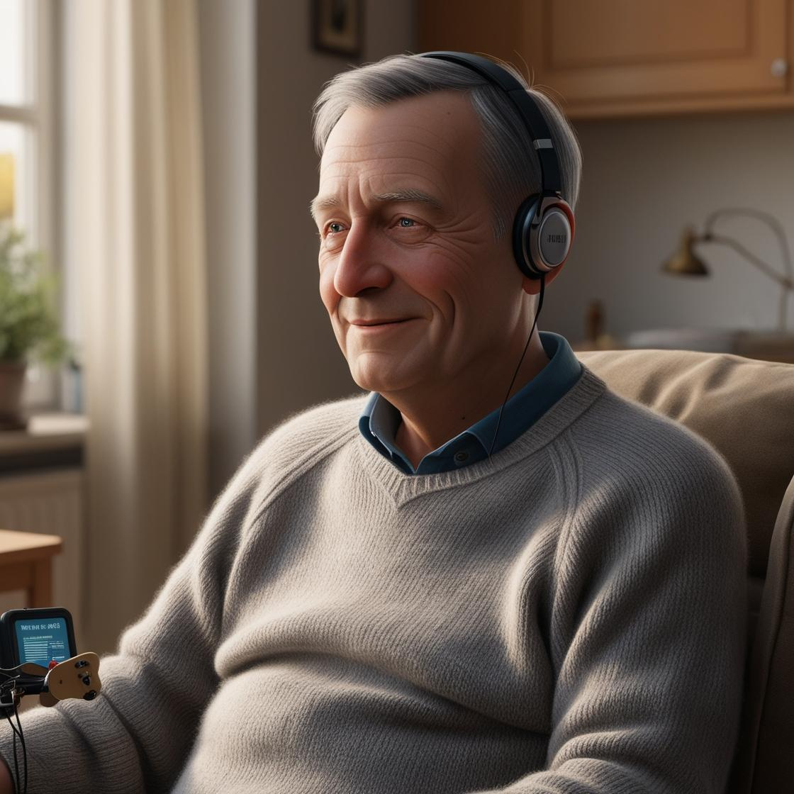

## Martin Scholz - Nutzer
  
- Alter: 62 Jahre
- Geschlecht: Männlich
- Job Titel: Ehemaliger Werkzeugmechaniker (seit 3 Jahren berentet)
- Work Hours: —
- Ausbildung: Abgeschlossene Berufsausbildung, heute berentet
- Standort: Nürnberg, Deutschland
- Einkommen: 1.250 EUR monatliche Erwerbsminderungsrente
- Family: Ledig, lebt allein mit ambulanter Pflegeunterstützung
- Interessen: 80er-Rockmusik, Krimi-Hörbücher, Dokus über Technik

Martin hat durch eine ALS-Diagnose seine feinmotorischen Fähigkeiten stark eingeschränkt. Er kann Maus und Touchpad kaum nutzen und möchte trotzdem selbstbestimmt Musik hören.

## Laura Bergmann - Pflege
  
- Alter: 29 Jahre
- Geschlecht: Weiblich
- Job Titel: Pflegefachkraft in einem ambulanten Pflegedienst
- Work Hours: ca. 35 Stunden pro Woche im Schichtdienst
- Ausbildung: Staatlich anerkannte Pflegefachfrau
- Standort: Mainz, Deutschland
- Einkommen: 2.800 EUR brutto monatlich
- Family: Alleinerziehend, 1 Sohn (3 Jahre)
- Interessen: Podcast hören, mit ihrem Sohn Ball spielen

Laura betreut täglich mehrere Personen mit motorischen Einschränkungen. Häufig wünscht man sich dort einfache Lösungen für Medienzugang – besonders zur Beruhigung, Aktivierung oder einfach zur Freude. 

## Tarek Said - Accessibility & Tech
  
- Alter: 34 Jahre
- Geschlecht: Männlich
- Job Titel: Frontend Developer & A11Y-Spezialist bei einer NGO
- Work Hours: 40 Stunden pro Woche
- Ausbildung: Master in Human-Computer Interaction
- Standort: Hamburg, Deutschland
- Einkommen: 68.000 EUR pro Jahr
- Family: In einer Partnerschaft, keine Kinder
- Interessen: Barrierefreie Technik, Open Source, Musikproduktion, Street Photography

Tarek interessiert sich beruflich wie privat für barrierefreies Webdesign. Er prüft regelmäßig Projekte auf ihre WCAG-Konformität und beteiligt sich an Open-Source-Initiativen. Ihm ist wichtig, dass ein Projekt semantisch sauber, gut dokumentiert und auch technisch für andere nutzbar oder weiterentwickelbar ist.