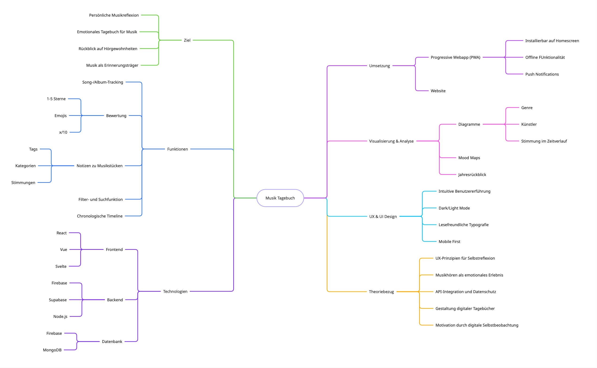
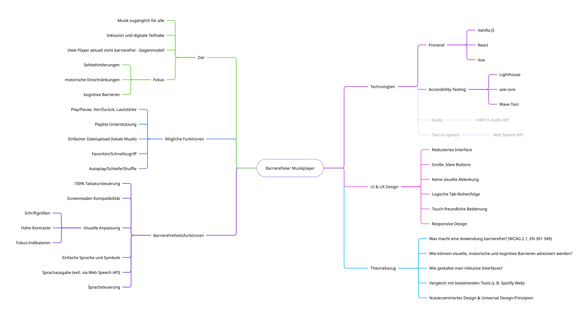

## Idee 1: Musikjournal-Webapp

### Kurzbeschreibung
Ein digitales Tagebuch für Musikliebhaber. Nutzer*innen können gehörte Songs oder Alben festhalten, bewerten, beschreiben und später darauf zurückblicken – ähnlich wie ein Lesetagebuch, nur für Musik.

### Mögliche Features
- Song- oder Album-Tracking (manuell oder via Spotify API)
- Persönliche Notizen und Bewertungen
- Visualisierung der Hörgewohnheiten (z. B. Lieblingsgenre im Monat)
- Filter- und Suchfunktion
- Exportfunktion (z. B. als PDF)
- Optional: Progressive Web App (PWA) mit Offlinefunktion

### Forschungsfragen
1. „Wie kann eine Webanwendung zur Musikreflexion gestaltet werden, um das persönliche Musikerleben langfristig zu fördern und zu dokumentieren?“
2. „Welche technischen Herausforderungen und Potenziale ergeben sich bei der Integration der Spotify API in eine progressive Web App zur persönlichen Musikdokumentation?“
3. „Wie kann eine Webanwendung für Musikjournalismus gestaltet werden, um persönliche Musikrezeption visuell und emotional nachvollziehbar abzubilden?“
4. „Wie kann eine barrierearme Musik-Webanwendung gestaltet werden, die persönliche Musikpräferenzen erfasst und zugänglich aufbereitet?“

### Concept Map (Themenfeld-Cluster)

---

## Idee 2: Barrierefreier Musikplayer (Webanwendung)

### Kurzbeschreibung
Ein bewusst barrierefreier Web-Musikplayer für Menschen mit Einschränkungen. Ziel ist eine einfach zugängliche, inklusive Anwendung zur Musikwiedergabe.

### Mögliche Features
- Einfache Steuerung (Play, Pause, Lautstärke, etc.)
- Tastaturbedienung und Screenreader-Kompatibilität
- Große, kontrastreiche Bedienelemente
- Optionale Sprachsteuerung oder Sprachausgabe
- Mobile Nutzung mit PWA-Funktion (Offlinefähigkeit, Homescreen)

### Forschungsfragen
1. „Welche Gestaltungsprinzipien sind für die barrierefreie Nutzung eines webbasierten Musikplayers essenziell – insbesondere für Menschen mit visuellen oder motorischen Einschränkungen?“
2. „Wie kann ein Web-Musikplayer entwickelt werden, der auch für Nutzer*innen mit Sehbehinderung intuitiv und selbstbestimmt bedienbar ist?“
3. „Wie kann ein Musikplayer so gestaltet werden, dass er auch für Menschen mit kognitiven Einschränkungen leicht verständlich und bedienbar ist?“
4. „Welche Technologien und Designmuster eignen sich zur Umsetzung eines barrierefreien, sprachgesteuerten Musikplayers als Webanwendung?“

### Concept Map (Themenfeld-Cluster)

---

*Letztes Update: 06. Mai 2025*
